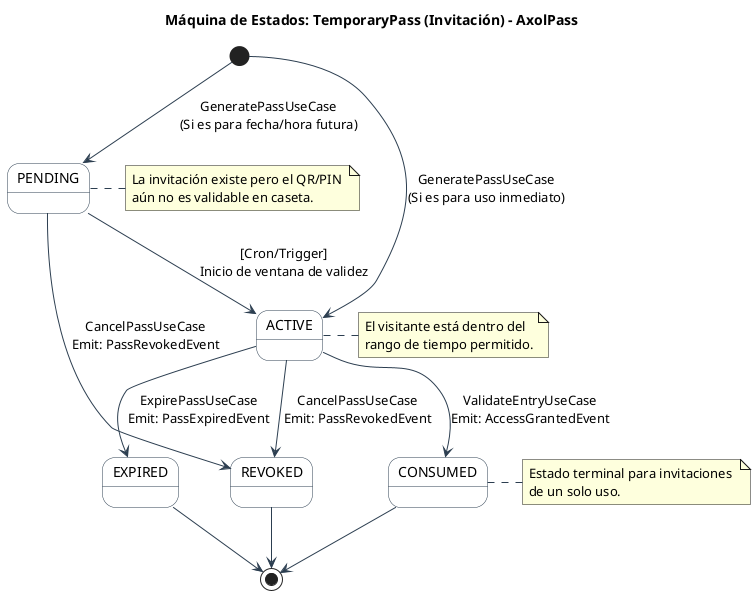

Máquina de estados para el ciclo de vida de una Invitación (`TemporaryPass`)

### Detalles de los Estados y Transiciones

* **PENDING (Pendiente):** Es un estado transitorio vital. Si un residente genera un pase el lunes para una visita el viernes, el pase nace como `PENDING`. Si el guardia escanea el QR antes del viernes, el motor de reglas del dominio debe rechazarlo, ya que no ha transcurrido hacia `ACTIVE`.
* **ACTIVE (Activo):** El QR o PIN es válido para ser procesado por la controladora de la caseta.
* **CONSUMED (Consumido):** Estado terminal de éxito. Se alcanza únicamente cuando el `ValidateEntryUseCase` procesa el código exitosamente. En pases de un solo uso, esto bloquea cualquier intento de reutilización. *(Nota: Si el sistema soportara pases multi-entrada o de trabajadores de obra, este estado podría ciclar de vuelta a `ACTIVE` bajo ciertas reglas, pero para visitas estándar es terminal).*
* **EXPIRED (Expirado):** Estado terminal automatizado. Aquí es donde entra en acción el `ExpirePassUseCase` que definimos previamente, ejecutado por un *cron job* o un programador de eventos de dominio cuando la ventana de tiempo (ej. 24 horas) llega a su fin sin que el pase haya sido `CONSUMED`.
* **REVOKED (Revocado):** Estado terminal manual. Ocurre cuando el residente o el `CommunityAdmin` deciden cancelar explícitamente el pase antes de que se use o expire, emitiendo el `PassRevokedEvent` para invalidarlo inmediatamente en los dispositivos de borde de las casetas.

