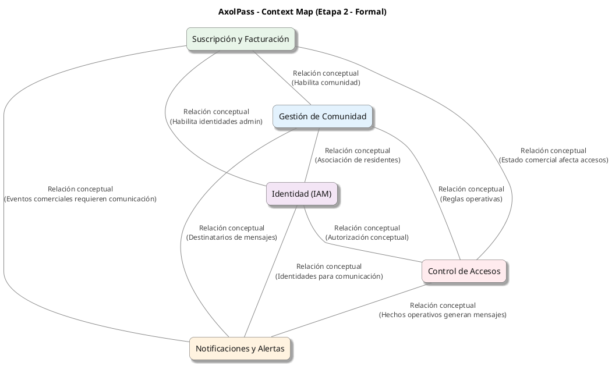
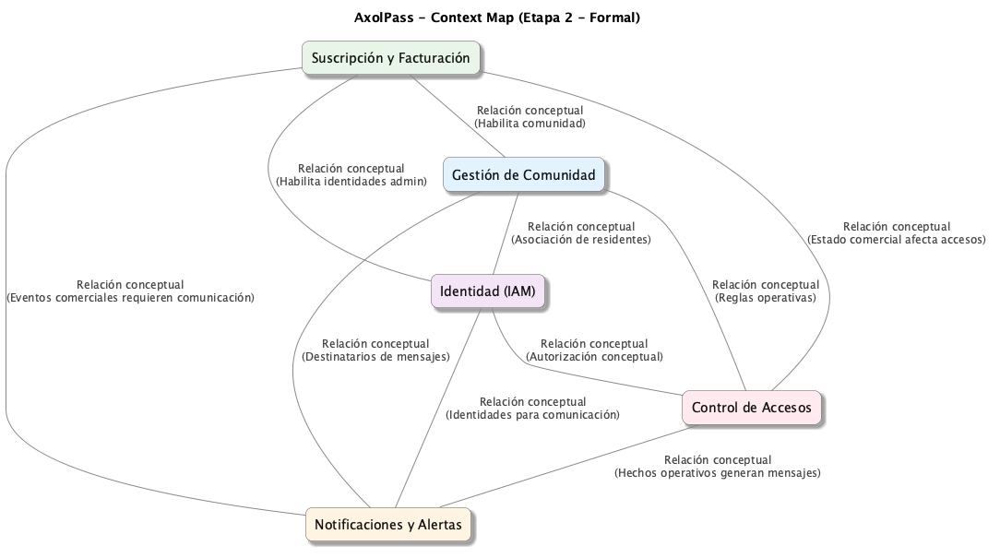

# 🌐 Context Map Formal – Etapa 2  
Representa cómo se relacionan conceptualmente los bounded contexts del dominio AxolPass.

---

## 🧩 Relaciones conceptuales entre los bounded contexts

### **1. Suscripción y Facturación ↔ Comunidad**
- Suscripción **habilita** la existencia de una comunidad.  
- Comunidad **consume** el estado comercial para determinar su operatividad.

### **2. Suscripción y Facturación ↔ Accesos**
- El estado comercial **afecta** la capacidad de permitir accesos.  
- Accesos **respeta** la vigencia comercial.

### **3. Suscripción y Facturación ↔ IAM**
- Suscripción **autoriza** la creación de identidades administrativas.  
- IAM **depende** del estado comercial para habilitar o suspender cuentas.

### **4. Suscripción y Facturación ↔ Notificaciones**
- Suscripción **genera eventos** que requieren comunicación (cobranza, suspensión).  
- Notificaciones **distribuye** esos mensajes.

---

### **5. Comunidad ↔ IAM**
- Comunidad **usa** identidades globales para asociar residentes.  
- IAM **define** roles y alcances operativos dentro de la comunidad.

### **6. Comunidad ↔ Accesos**
- Comunidad **provee reglas operativas** (aforo, horarios, estado de viviendas).  
- Accesos **valida** cada entrada contra esas reglas.

### **7. Comunidad ↔ Notificaciones**
- Comunidad **provee destinatarios** (residentes, administradores).  
- Notificaciones **envía** comunicaciones basadas en eventos comunitarios.

---

### **8. IAM ↔ Accesos**
- IAM **define** quién puede operar en el sistema (guardias, admins, residentes).  
- Accesos **consulta** permisos conceptuales para validar acciones.

### **9. IAM ↔ Notificaciones**
- IAM **define** identidades y preferencias conceptuales.  
- Notificaciones **usa** esas identidades para dirigir mensajes.

---

### **10. Accesos ↔ Notificaciones**
- Accesos **genera hechos** (llegadas, salidas, excepciones).  
- Notificaciones **comunica** esos hechos a los actores relevantes.

---

# 📄 PlantUML – Context Map Formal (Etapa 2)

