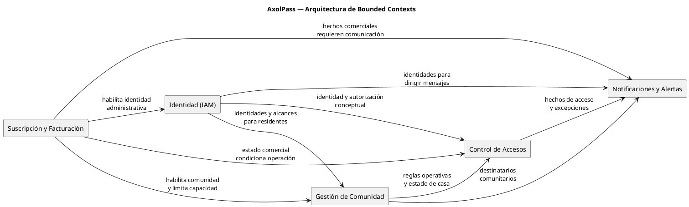
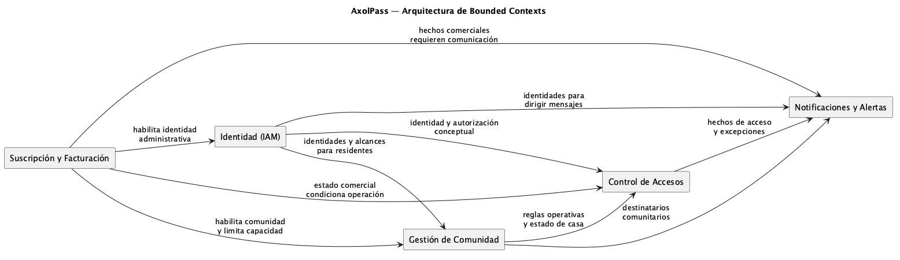

# Arquitectura de Bounded Contexts — AxolPass

## Propósito

Este documento establece los límites del dominio y las relaciones **conceptuales de negocio** entre los bounded contexts formalizados para el MVP de AxolPass. No define microservicios, APIs, almacenamiento, mensajería, despliegue ni mecanismos de autenticación o entrega.

La fuente de verdad de esta arquitectura es la etapa formal del dominio. Cuando la documentación de descubrimiento o conceptual contiene un límite adicional, se conserva como pendiente de formalización en lugar de convertirlo aquí en comportamiento o arquitectura nueva.

## Alcance y fuentes

Los cinco contextos de esta arquitectura están definidos en [Bounded Contexts formales](../02-Formal-domain/01-Bounded-context.md), sus relaciones se contrastan con el [Context Map formal](../02-Formal-domain/02-Bounded-context-map.md), y sus responsabilidades se respaldan con los [modelos de dominio](../02-Formal-domain/04-domain-models/). Las restricciones y hechos transversales se toman de los [casos de uso del MVP](../02-Formal-domain/07-Business-use-cases.md) y las [políticas de negocio](../02-Formal-domain/08-Business-policies.md).

## Principios de delimitación

- Cada contexto conserva sus propias reglas, términos y ciclo de vida de negocio.
- Una relación entre contextos expresa una necesidad de negocio; no prescribe un protocolo ni una dependencia técnica.
- Las identidades se referencian como identificadores únicos provistos por IAM; los demás contextos no duplican los datos personales.
- El registro de evidencia inmutable es transversal a los hechos relevantes. La evidencia no cambia el resultado original del hecho.
- Ante un apagón comercial o una suspensión de casa, se preservan las salidas, las aperturas de emergencia y la trazabilidad necesaria para la seguridad física.

## Contextos formalizados

| Contexto | Responsabilidad y límite | Conceptos bajo su responsabilidad | Relaciones de negocio explícitas |
| --- | --- | --- | --- |
| **Suscripción y Facturación** | Gobierna la relación comercial entre Axolote y cada comunidad: contrato, capacidad, vigencia, pagos y estado comercial. No administra residentes, accesos ni reglas operativas. | Suscripción, registro de pago, perfil financiero, período de gracia, estado comercial. | Habilita la comunidad y la identidad administrativa; su estado comercial condiciona la operación de accesos; origina comunicaciones comerciales. |
| **Gestión de Comunidad** | Administra la estructura física y organizativa: comunidad, casas, vínculos de residencia y configuración operativa. No decide accesos ni administra notificaciones. | Comunidad, casa, modelo de propiedad, vínculo de residencia, configuración de comunidad, estado operativo. | Usa identidades de IAM; provee reglas operativas y estado de casas a Accesos; provee destinatarios a Notificaciones; está limitada por la capacidad comercial. |
| **Identidad (IAM)** | Define la identidad de los actores, sus roles y sus alcances operativos. No administra viviendas, invitaciones, accesos ni estados comerciales. | Usuario global, rol, alcance operativo, estado de cuenta, identificador externo. | Provee identificadores y autorización conceptual a los demás contextos; la alta de la identidad administrativa está vinculada al aprovisionamiento comercial. |
| **Control de Accesos** | Gestiona invitaciones, decisiones de entrada y salida, aforo y contingencias. No gestiona la relación comercial, la estructura de comunidad ni el envío de mensajes. | Invitación, visitante, registro de acceso, decisión de acceso, cuota de estacionamiento, contingencia de emergencia. | Aplica reglas y estados provistos por Comunidad, respeta el estado comercial de Suscripción, usa la autorización conceptual de IAM y genera hechos que requieren comunicación. |
| **Notificaciones y Alertas** | Comunica hechos relevantes a residentes, visitantes y administradores. No evalúa accesos, estados comerciales, reglas ni permisos. | Notificación, mensaje, destinatario, alerta, política de notificación. | Recibe hechos relevantes de Suscripción, Comunidad y Accesos; usa identidades y destinatarios para dirigir la comunicación. No modifica el resultado del hecho que comunica. |

## Mapa de relaciones conceptuales

Las flechas expresan únicamente la dirección de la información o condición de negocio descrita en el Context Map formal; no indican llamadas, eventos técnicos ni propiedad de datos fuera de cada límite.

## Contratos conceptuales entre contextos

| Origen | Destino | Hecho, condición o información de negocio documentada | Efecto documentado |
| --- | --- | --- | --- |
| Suscripción y Facturación | Gestión de Comunidad | Capacidad contratada, vigencia y estado comercial. | La comunidad existe dentro de su relación comercial y no supera la capacidad contratada. |
| Suscripción y Facturación | IAM | Alta de comunidad y administrador local. | Se habilita la identidad administrativa asociada a la comunidad. |
| Suscripción y Facturación | Control de Accesos | Apagón comercial activo o desactivado. | Se bloquean nuevos ingresos ordinarios e invitaciones durante el apagón; no se bloquean salidas ni emergencias. |
| Suscripción y Facturación | Notificaciones y Alertas | Cambios comerciales que requieren comunicación. | Se informa el cambio comercial correspondiente. |
| IAM | Gestión de Comunidad | Identidad global, rol y alcance para asociar residentes. | Los vínculos de residencia usan identidades globales y los roles conservan su alcance. |
| Gestión de Comunidad | Control de Accesos | Reglas configuradas, zona horaria, límite de invitaciones, aforo y estado operativo de casa. | Accesos valida invitaciones y entradas con esas condiciones. |
| Gestión de Comunidad | Notificaciones y Alertas | Residentes y administradores destinatarios. | Las comunicaciones se dirigen al destinatario que corresponde. |
| IAM | Control de Accesos | Rol y alcance del actor. | Se determina la autorización conceptual para operar. |
| IAM | Notificaciones y Alertas | Identidad del destinatario. | La comunicación se dirige a una identidad definida. |
| Control de Accesos | Notificaciones y Alertas | Resultado de acceso, rechazo, invitación y contingencia cuando requiere comunicación. | Se entrega el pase o se informa el hecho, sin alterar la decisión de acceso. |

## Responsabilidades transversales

### Trazabilidad inmutable

La trazabilidad es un requisito transversal, no un bounded context formalizado en la etapa actual. Todo hecho que afecte seguridad, invitaciones, accesos, aforo, configuración de comunidad, residencia o vigencia comercial debe conservar evidencia con fecha y hora, tipo, actor o responsable cuando corresponda, ámbito relacionado y resultado. La consulta de esa evidencia respeta el ámbito autorizado y la privacidad establecida.

### Reglas y políticas de negocio

Las reglas operativas de comunidad pertenecen a Gestión de Comunidad y son aplicadas por Control de Accesos. Las políticas comerciales pertenecen a Suscripción y Facturación; las de invitaciones, acceso, aforo y contingencia se expresan en Control de Accesos; las de comunicación se expresan en Notificaciones y Alertas. No se define un motor de reglas independiente, pues los artefactos formales del MVP no le asignan límites, lenguaje, ciclo de vida ni relaciones propios.

## Contextos o límites pendientes de formalización

Esta sección no crea contextos nuevos. Registra áreas identificadas en la documentación conceptual o de descubrimiento que requieren una decisión de delimitación antes de incorporarse a la arquitectura formal.

| Área identificada | Evidencia existente | Estado en esta arquitectura | Información necesaria para formalizarla como bounded context |
| --- | --- | --- | --- |
| **Auditoría y reportes** | El dominio conceptual identifica `Access Monitoring & Reports` y el MVP exige trazabilidad inmutable; los reportes/exportaciones están excluidos del MVP. | Se trata como requisito transversal de evidencia; no se establece un contexto independiente. | Propósito propio, lenguaje ubicuo, datos que posee, reglas de consulta/retención, consumidores y relación con los contextos que originan los hechos. |
| **Motor de reglas** | La etapa conceptual identifica `Rule Engine`; en el modelo formal, la configuración de reglas vive en Comunidad y su aplicación en Accesos. | No se establece como contexto independiente. | Reglas que administraría de forma autónoma, ciclo de vida, autoridad de modificación, lenguaje y relaciones que no estén ya cubiertas por Comunidad o Accesos. |
| **Gestión de guardias** | La etapa conceptual identifica `Guard Management`; el modelo formal asigna identidad, rol y alcance a IAM, y las intervenciones de caseta a Control de Accesos. | No se establece como contexto independiente. | Responsabilidades que excedan roles/alcances e intervenciones de acceso, entidades propias, reglas y relación con IAM y Accesos. |
| **Fallback y recuperación** | La etapa conceptual identifica `Fallback & Recovery`; los casos de uso formales incluyen aperturas manuales, contingencias y emergencias en Control de Accesos. | Se mantiene dentro de Control de Accesos para el MVP. | Si se requiere separarlo, deben definirse sus propios conceptos, reglas, ciclo de vida y relación con las contingencias ya formalizadas. |

## Límites explícitamente no definidos

Quedan fuera de esta arquitectura, porque no están definidos como comportamiento del MVP o porque los documentos formales los excluyen: reportes y exportaciones, integraciones avanzadas, preferencias de notificación, pagos automáticos, detalles de entrega de mensajes, interfaces de caseta, dispositivos, lectores, protocolos de autenticación y topología de despliegue.

## Decisiones aún requeridas

- Formalizar o descartar los límites pendientes de la sección anterior antes de asignarles propiedad de datos o relaciones adicionales.
- Formalizar los criterios operativos de las políticas de aforo de excepción y flexible antes de adoptarlas; actualmente solo la política estricta tiene un criterio de rechazo definido.
- Definir, en un artefacto posterior, cualquier decisión técnica de integración o implementación sin alterar los límites de negocio descritos aquí.
