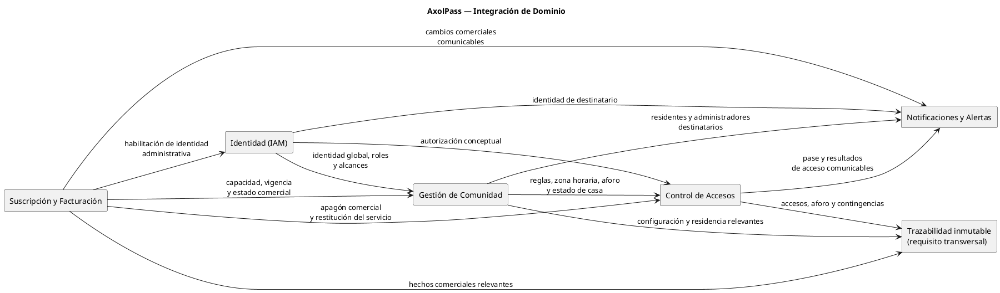

# Arquitectura de Integración de Dominio

## Propósito y alcance

Este documento define las integraciones **conceptuales de negocio** entre los bounded contexts formalizados de AxolPass. Describe qué condición, información o hecho de negocio necesita otro contexto y cuál es la consecuencia ya documentada.

No define APIs, esquemas de mensajes, colas, eventos técnicos, protocolos, sincronía, reintentos, orden de entrega, topología de despliegue ni propiedad de infraestructura. Una flecha o fila de este documento no prescribe cómo se implementa la integración.

Las fuentes son el [Context Map formal](../02-Formal-domain/02-Bounded-context-map.md), los [Casos de Uso de Negocio](../02-Formal-domain/07-Business-use-cases.md), las [Políticas de Negocio formales](../02-Formal-domain/08-Business-policies.md), la [Arquitectura de Bounded Contexts](./bounded-context-architecture.md) y el [catálogo arquitectónico de políticas](./business-policies.md).

## Principios de integración de dominio

- Cada contexto conserva sus propios conceptos y reglas; la integración transmite o consulta solo la condición necesaria para la consecuencia documentada.
- Los hechos de negocio se expresan en pasado y sus efectos no determinan un mecanismo técnico de transporte.
- Notificaciones y Alertas comunica un hecho; no modifica la decisión comercial, comunitaria o de acceso que lo originó.
- La evidencia inmutable se exige de manera transversal para los hechos relevantes, pero no está delimitada como un contexto independiente del MVP.
- El apagón comercial, la suspensión de casa y las contingencias no pueden impedir las salidas seguras ni la trazabilidad asociada.

## Mapa de integraciones conceptuales

## Catálogo de integraciones documentadas

| Origen conceptual | Destino conceptual | Hecho, condición o información | Consecuencia documentada | Límites explícitos |
| --- | --- | --- | --- | --- |
| Suscripción y Facturación | Gestión de Comunidad | Capacidad contratada, vigencia y estado comercial de la comunidad. | La comunidad existe dentro de la relación comercial y el total de casas no supera la capacidad contratada. | La operación comercial no administra la estructura de casas ni las reglas operativas de la comunidad. |
| Suscripción y Facturación | IAM | Alta de un fraccionamiento y administrador local asociado. | Se habilita la identidad administrativa vinculada a la comunidad. | No se definen credenciales, autenticación técnica ni ciclo de vida formal del usuario en esta integración. |
| Suscripción y Facturación | Control de Accesos | `SuscripcionSuspendida` / apagón comercial, o cobertura comercial recuperada. | El apagón bloquea nuevas invitaciones e ingresos ordinarios; al recuperar cobertura se restituye la operación comunitaria. | No se bloquean salidas ni aperturas de emergencia; la restitución no reactiva casas suspendidas ni invitaciones canceladas o expiradas por causa propia. |
| Suscripción y Facturación | Notificaciones y Alertas | Cambios comerciales que requieren comunicación, incluida la suspensión. | Se informa el cambio comercial correspondiente al `CommunityAdmin` cuando aplica. | La comunicación no altera el estado comercial. |
| IAM | Gestión de Comunidad | Identidad global, rol y alcance para asociar residentes y administradores. | Las relaciones de residencia usan una identidad global y los roles conservan su ámbito operativo. | Gestión de Comunidad no duplica la identidad personal ni administra sus credenciales. |
| Gestión de Comunidad | Control de Accesos | Zona horaria, límite diario de invitaciones, capacidad de visitantes, política de aforo, y estado operativo de la casa. | Accesos valida generación de invitaciones y entradas contra esas condiciones. | La política estricta tiene criterio de rechazo definido; excepción y flexible permanecen sin criterio operativo formal. |
| Gestión de Comunidad | Control de Accesos | `ResidenteDesvinculado` con invitaciones futuras pendientes. | Se cancelan las invitaciones pendientes originadas por el residente desvinculado. | Una visita ya iniciada conserva su salida y la evidencia no se borra. |
| Gestión de Comunidad | Control de Accesos | `CasaSuspendida` con invitaciones futuras pendientes. | Se cancelan las invitaciones pendientes de la casa. | La suspensión afecta solo a esa casa; no cancela visitas en curso ni impide sus salidas. |
| Gestión de Comunidad | Notificaciones y Alertas | Residentes y administradores que actúan como destinatarios. | La comunicación se dirige al residente o administrador que corresponde. | El contexto de notificaciones no determina por sí mismo los vínculos de residencia. |
| IAM | Control de Accesos | Rol y alcance del actor, incluido el ámbito de un `SecurityGuard`. | Se determina la autorización conceptual para realizar la operación. | IAM no decide la validez de una invitación ni el resultado de acceso. |
| IAM | Notificaciones y Alertas | Identidad del destinatario. | La comunicación se dirige a una identidad definida. | Las preferencias ordinarias de notificación están fuera del MVP. |
| Control de Accesos | Notificaciones y Alertas | `InvitacionGenerada` con contacto del visitante. | Se entrega un pase de acceso de un solo uso, con QR y PIN numérico, por correo electrónico y WhatsApp. | La entrega no cambia vigencia ni estado de la invitación. |
| Control de Accesos | Notificaciones y Alertas | `AccesoConcedido`, `AccesoRechazado`, `AccesoManualConcedido` o `AccesoManualRechazado`, con residente destinatario activo. | Se informa el resultado al residente correspondiente. | La alerta no demora ni modifica la decisión; su no entrega no invalida un acceso ni revierte un rechazo. |
| Contextos que producen hechos relevantes | Trazabilidad inmutable (requisito transversal) | Hechos de seguridad, invitación, acceso, aforo, configuración, residencia, vigencia comercial, rechazo o intervención manual/emergencia. | Se conserva evidencia inmutable con fecha/hora, tipo, responsable identificable cuando aplica, ámbito relacionado y resultado. | Los actores operativos no modifican ni eliminan evidencia; la consulta respeta visibilidad autorizada y privacidad. |

## Integraciones gobernadas por políticas de negocio

| Política | Integración de dominio que gobierna | Consecuencia entre contextos |
| --- | --- | --- |
| POL-NEG-01 | Suscripción y Facturación → Gestión de Comunidad | La fecha de inicio alcanzada activa la comunidad cuando existe cobertura comercial. |
| POL-NEG-02 y POL-NEG-03 | Suscripción y Facturación → Control de Accesos / Notificaciones y Alertas | La suspensión activa apagón comercial y comunica la suspensión; la cobertura recuperada desactiva el apagón. |
| POL-NEG-04 | Gestión de Comunidad ↔ Suscripción y Facturación | La capacidad contratada limita nuevas casas. |
| POL-NEG-05 | Gestión de Comunidad → vínculos de residencia | La baja del residente principal desvincula residentes secundarios activos de la misma casa. |
| POL-NEG-06 y POL-NEG-07 | Gestión de Comunidad → Control de Accesos | Desvinculación de residente o suspensión de casa cancela invitaciones futuras pendientes. |
| POL-NEG-08 y POL-NEG-14 | Control de Accesos → Notificaciones y Alertas | Se entrega el pase y se comunican los resultados de acceso cuando se cumplen sus condiciones. |
| POL-NEG-09 a POL-NEG-13 | Gestión de Comunidad / Suscripción y Facturación → Control de Accesos | Las reglas de aforo, estado comercial y estado de casa condicionan ocupación, liberación y la protección de salida segura. |
| POL-NEG-15 | Todos los orígenes de hechos relevantes → trazabilidad transversal | Se incorpora evidencia inmutable sin modificar el hecho original. |
| POL-NEG-16 | IAM / Control de Accesos → trazabilidad transversal | Una intervención manual o emergencia asociada a un guardia identificable queda registrada y, si es emergencia, pendiente de justificación. |

## Información que no debe cruzar como responsabilidad de negocio

| Contexto | Información o decisión que conserva | Razón documentada |
| --- | --- | --- |
| Suscripción y Facturación | Residentes, accesos, dispositivos, reglas operativas y notificaciones específicas. | Su límite es comercial. |
| Gestión de Comunidad | Decisión de acceso, pase o envío de notificaciones. | Administra estructura, residentes y reglas internas. |
| IAM | Viviendas, invitaciones, accesos y estados comerciales. | Define identidad, roles y alcance. |
| Control de Accesos | Condiciones comerciales, estructura de comunidad y envío de mensajes. | Gestiona invitaciones, decisiones de acceso, aforo y contingencias. |
| Notificaciones y Alertas | Evaluación de accesos, reglas, estados comerciales y permisos. | Comunica hechos, sin decidirlos ni modificarlos. |

## Integraciones pendientes de formalización

Esta sección no crea integraciones nuevas. Registra decisiones necesarias para poder diseñar una implementación sin asumir comportamientos no documentados.

| Tema pendiente | Evidencia actual | Definición requerida |
| --- | --- | --- |
| Contratos técnicos de integración | Los documentos describen hechos y consecuencias de negocio, pero no contratos de API, esquemas, canales ni mecanismos de transporte. | Formato, versión, seguridad, responsabilidad de publicación/consumo y contrato técnico por integración aprobada. |
| Semántica de entrega y procesamiento | No se documentan sincronía, orden, reintentos, deduplicación, tolerancia a fallas ni manejo de mensajes no entregados. | Reglas técnicas y operativas para cada integración, sin modificar las políticas de negocio. |
| Aforo de excepción y flexible | Solo la política estricta define rechazo al alcanzar el límite. | Criterios de autorización, registro y ocupación para las políticas de excepción y flexible. |
| Notificación de cancelación de invitación | El Event Storming formal la menciona; los casos de uso y las políticas formales del MVP no la especifican. | Confirmación de alcance y, si aplica, desencadenante, destinatario, restricciones y resultado. |
| Trazabilidad como límite independiente | La trazabilidad es transversal; no existe bounded context formal para auditoría y reportes. | Decidir si continúa como requisito transversal o definir propósito, lenguaje, propiedad de datos, retención y consumidores de un contexto propio. |
| Identidad y cambios de cuenta | IAM aparece como proveedor de identidad y autorización, pero sus transiciones de cuenta no están formalizadas por los casos de uso del MVP. | Disparadores, reglas y consecuencias de cambios de estado, rol o alcance que deban integrarse con otros contextos. |

## Fuera de alcance

No se definen integraciones para reportes o exportaciones, pagos automáticos, preferencias ordinarias de notificación, dispositivos, lectores, interfaces de caseta, proveedores técnicos, autenticación técnica, despliegue ni observabilidad de infraestructura. Estos elementos están excluidos del MVP o no tienen definición de integración de dominio en las fuentes.
