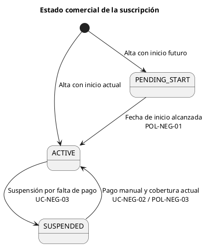
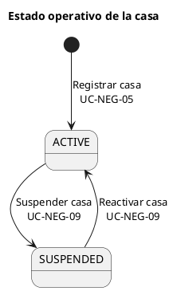
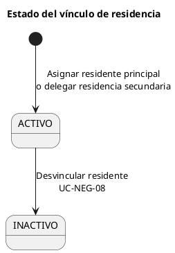
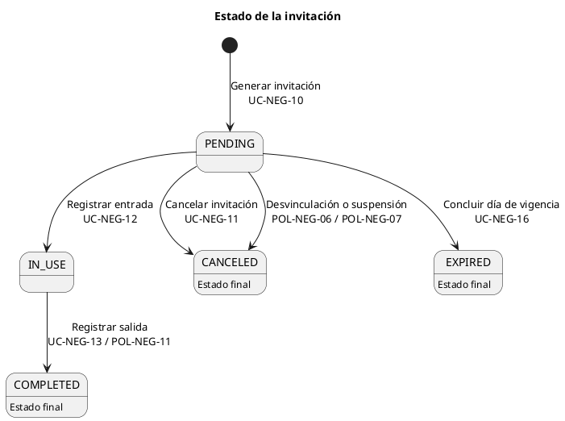
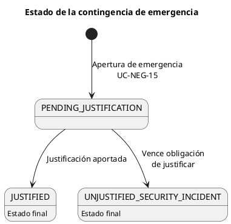

# Modelos de Estado — Arquitectura de Dominio

## Propósito y alcance

Este documento presenta los ciclos de vida de negocio formalizados para el MVP y los ubica en sus bounded contexts. Solo incluye estados, transiciones, disparadores y restricciones expresamente definidos en los [Modelos de Estados del Negocio](../02-Formal-domain/09-Business-state-models.md), los [Casos de Uso de Negocio](../02-Formal-domain/07-Business-use-cases.md) y las [Políticas de Negocio](./business-policies.md).

No define estados de implementación, conectividad, entrega de mensajes, dispositivos, lectores o interfaces. Tampoco introduce transiciones adicionales.

## Resumen de propiedad conceptual

| Modelo de estado | Bounded context principal | Contextos que aportan condiciones o consecuencias documentadas |
| --- | --- | --- |
| Estado comercial de la suscripción | Suscripción y Facturación | Gestión de Comunidad, Control de Accesos, Notificaciones y Alertas |
| Estado operativo de la casa | Gestión de Comunidad | Control de Accesos |
| Estado del vínculo de residencia | Gestión de Comunidad | IAM, Control de Accesos |
| Estado de la invitación | Control de Accesos | Gestión de Comunidad, Suscripción y Facturación |
| Estado de contingencia de emergencia | Control de Accesos | IAM, trazabilidad transversal |

## 1. Estado comercial de la suscripción

### Estados válidos

| Estado | Significado |
| --- | --- |
| `PENDING_START` | La comunidad tiene una fecha de inicio futura. Puede prepararse, pero no realiza accesos ordinarios ni genera invitaciones. |
| `ACTIVE` | La comunidad cuenta con autorización comercial para operar normalmente. |
| `SUSPENDED` | La comunidad está bajo apagón comercial por falta de cobertura. |

### Transiciones permitidas

| Origen | Disparador | Destino | Condición o regla |
| --- | --- | --- | --- |
| — | UC-NEG-01: Dar de Alta un Fraccionamiento | `ACTIVE` | La fecha de inicio pactada corresponde al día de alta. |
| — | UC-NEG-01: Dar de Alta un Fraccionamiento | `PENDING_START` | La fecha de inicio pactada es futura. |
| `PENDING_START` | Fecha de inicio alcanzada / POL-NEG-01 | `ACTIVE` | El contrato sigue vigente y cuenta con cobertura para la fecha. |
| `ACTIVE` | UC-NEG-03: Suspender Comunidad por Falta de Pago | `SUSPENDED` | La vigencia pagada expiró o existe una causa comercial autorizada. |
| `SUSPENDED` | UC-NEG-02: Registrar Pago Manual / POL-NEG-03 | `ACTIVE` | La vigencia extendida cubre la fecha actual. |

`SUSPENDED` preserva salidas, emergencias y trazabilidad. El retorno a `ACTIVE` no reactiva casas suspendidas ni invitaciones canceladas o expiradas por causa propia. No hay transición formal `PENDING_START → SUSPENDED`.

## 2. Estado operativo de la casa

### Estados válidos

| Estado | Significado |
| --- | --- |
| `ACTIVE` | La casa puede ejercer privilegios operativos, sujeta al estado comercial y reglas aplicables. |
| `SUSPENDED` | La casa está restringida por una decisión administrativa local; no genera invitaciones ni recibe accesos ordinarios. |

### Transiciones permitidas

| Origen | Disparador | Destino | Condición o regla |
| --- | --- | --- | --- |
| — | UC-NEG-05: Registrar Casas de la Comunidad | `ACTIVE` | Se registra dentro de la capacidad contratada y con nomenclatura única. |
| `ACTIVE` | UC-NEG-09: Suspender o Reactivar una Casa | `SUSPENDED` | El `CommunityAdmin` tiene autoridad y registra un motivo. |
| `SUSPENDED` | UC-NEG-09: Suspender o Reactivar una Casa | `ACTIVE` | El `CommunityAdmin` decide restituir su operación y deja evidencia. |

La suspensión afecta solo a esa casa, cancela sus invitaciones futuras pendientes y no impide las salidas de visitas ya ingresadas. Una casa sin residentes puede estar `ACTIVE`. Repetir la solicitud del estado actual no produce una transición.

## 3. Estado del vínculo de residencia

### Estados válidos

| Estado | Significado |
| --- | --- |
| `ACTIVO` | La persona conserva un vínculo vigente como `ResidentMain` o `ResidentSecondary`. |
| `INACTIVO` | El vínculo terminó y se conserva como historia; dejan de aplicar sus privilegios. |

### Transiciones permitidas

| Origen | Disparador | Destino | Condición o regla |
| --- | --- | --- | --- |
| — | UC-NEG-06: Asignar Residente Principal | `ACTIVO` | Solo el `CommunityAdmin`; la casa está activa y no tiene otro principal activo. |
| — | UC-NEG-07: Delegar Residencia Secundaria | `ACTIVO` | La casa está activa, tiene residente principal y no se excede el límite acordado. |
| `ACTIVO` | UC-NEG-08: Desvincular Residentes de una Casa | `INACTIVO` | Existe el vínculo y el actor está autorizado a terminarlo. |

Una casa tiene como máximo un `ResidentMain` activo; un vínculo secundario requiere un principal activo. Si se inactiva el principal, los secundarios activos de la misma casa también pasan a `INACTIVO`. La desvinculación conserva historia, cancela invitaciones futuras pendientes originadas por el residente y preserva las salidas de visitas en curso.

## 4. Estado de la invitación

### Estados válidos

| Estado | Significado |
| --- | --- |
| `PENDING` | Invitación generada para su día de vigencia, sin entrada registrada. |
| `IN_USE` | La visita ingresó y su salida está pendiente. |
| `COMPLETED` | La visita registró salida; la invitación no permite otra entrada. |
| `CANCELED` | La invitación fue revocada antes de una entrada; su pase no permite ingreso. |
| `EXPIRED` | Concluyó el día de vigencia sin una entrada; su pase no permite ingreso. |

### Transiciones permitidas

| Origen | Disparador | Destino | Condición o regla |
| --- | --- | --- | --- |
| — | UC-NEG-10: Generar Invitación de Un Solo Uso | `PENDING` | Comunidad y casa operativas, residente con vínculo activo y límite diario no excedido. |
| `PENDING` | UC-NEG-12: Validar y Registrar Entrada Programada | `IN_USE` | Vigente en el día actual, casa activa, sin suspensión ni apagón comercial, y con reglas de aforo cumplidas. |
| `PENDING` | UC-NEG-11: Cancelar Invitación Pendiente | `CANCELED` | El actor está autorizado y la invitación no tuvo entrada. |
| `PENDING` | POL-NEG-06 | `CANCELED` | Se desvinculó al residente que originó la invitación. |
| `PENDING` | POL-NEG-07 | `CANCELED` | Se suspendió la casa asociada. |
| `PENDING` | UC-NEG-16: Expirar Invitaciones No Utilizadas | `EXPIRED` | Concluyó el día de vigencia, según la zona horaria de la comunidad, sin entrada. |
| `IN_USE` | UC-NEG-13: Registrar Salida de Visitante / POL-NEG-11 | `COMPLETED` | Existe una entrada previa en curso. |

`COMPLETED`, `CANCELED` y `EXPIRED` son finales. Una invitación en `IN_USE` no permite una segunda entrada, no se cancela y no expira por falta de uso. Un acceso rechazado no modifica su estado. El cruce de medianoche no impide registrar la salida de una invitación en uso.

## 5. Estado de la contingencia de emergencia

### Estados válidos

| Estado | Significado |
| --- | --- |
| `PENDING_JUSTIFICATION` | Ocurrió una apertura de emergencia y falta documentar su motivo. |
| `JUSTIFIED` | La contingencia cuenta con justificación válida y evidencia cerrada e inmutable. |
| `UNJUSTIFIED_SECURITY_INCIDENT` | No se justificó dentro de las condiciones establecidas y se clasifica como incidente de seguridad no justificado. |

### Transiciones permitidas

| Origen | Disparador | Destino | Condición o regla |
| --- | --- | --- | --- |
| — | UC-NEG-15: Registrar Apertura Manual o Contingencia de Caseta | `PENDING_JUSTIFICATION` | La apertura fue una emergencia para proteger vida, integridad, propiedad o vialidad. |
| `PENDING_JUSTIFICATION` | Justificación de contingencia pendiente | `JUSTIFIED` | El guardia aporta una justificación obligatoria y descriptiva. |
| `PENDING_JUSTIFICATION` | Vencimiento de la obligación de justificar | `UNJUSTIFIED_SECURITY_INCIDENT` | No se recibió justificación dentro de las condiciones establecidas. |

Este modelo aplica solo a aperturas de emergencia. Una apertura manual ordinaria queda auditada, pero no tiene ciclo de vida adicional formalizado. La emergencia puede eludir restricciones ordinarias para proteger de inmediato la seguridad física, exige regularización posterior y nunca puede impedir una salida segura.

## Ciclos de vida pendientes de formalización o fuera del modelo MVP

Esta sección no crea estados ni transiciones. Registra elementos presentes en otros artefactos que no cumplen el criterio de estado de negocio formal del MVP o que contienen información insuficiente para incorporarse.

| Elemento | Evidencia | Estado en este documento | Información necesaria para formalizarlo |
| --- | --- | --- | --- |
| Ciclo de vida de cuenta IAM | El modelo de dominio de IAM enumera `PENDING_ACTIVATION → ACTIVE ↔ SUSPENDED` y baja a `DISABLED`, pero no aparecen sus disparadores, condiciones y reglas en los casos de uso formales del MVP. | No se incorpora como modelo formal del MVP. | Disparadores, autoridad, precondiciones, consecuencias y políticas asociadas. |
| Ciclo de vida de notificación | El modelo de Notificaciones menciona *Encolado → Despachado o Fallido Permanentemente*. Los estados de entrega de mensajes están excluidos expresamente de los modelos de estado de negocio del MVP. | Fuera del modelo de negocio actual. | Si se requiere como estado de negocio, propósito, transiciones, reglas y alcance del MVP. |
| Estado `INACTIVE` de suscripción | Aparece en un modelo de dominio anterior, pero está excluido de los casos de uso formales del MVP. | No se incorpora. | Caso de uso, reglas, disparador y consecuencias de cancelación comercial. |
| Estado `INACTIVE` de casa | La inactivación de casa está excluida del modelo formal del MVP. | No se incorpora. | Caso de uso, transiciones, reglas y efectos sobre residentes, invitaciones y accesos. |
| Estado `AUTO_COMPLETED` de invitación | Se menciona en documentación de descubrimiento o modelo anterior; el modelo formal solo permite expirar invitaciones pendientes. | No se incorpora. | Caso de uso, disparador, reglas de cierre y efectos sobre aforo y salida. |
| Estado `PENDING_SETUP` de comunidad | El modelo de comunidad lo menciona, mientras el modelo de estados formal usa `PENDING_START` para el estado comercial y no define un ciclo separado de configuración comunitaria. | No se incorpora como estado separado. | Confirmación de si es un ciclo distinto, su entidad, transiciones, reglas y relación con `PENDING_START`. |
| Vencimiento de justificación de emergencia | El estado de contingencia requiere que la justificación ocurra dentro de condiciones establecidas, sin especificarlas. | La transición se conserva sin plazo ni criterio adicional. | Condiciones, plazo y autoridad para determinar el vencimiento. |

## Límites explícitos

Los diagramas PlantUML representan únicamente transiciones de negocio permitidas. No implican implementación de máquinas de estado, procesos automáticos, servicios, eventos técnicos ni asignación de persistencia.
